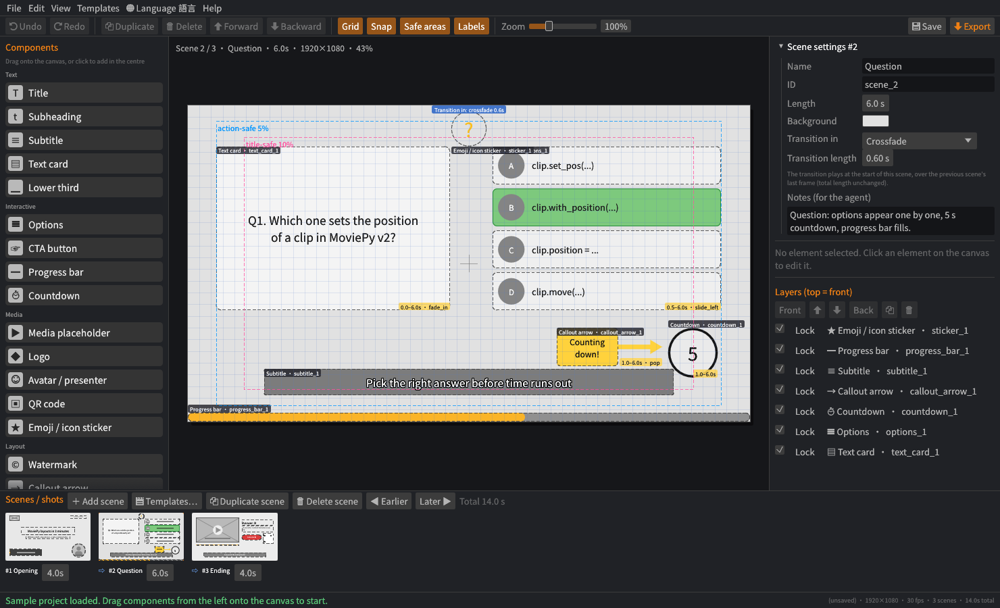
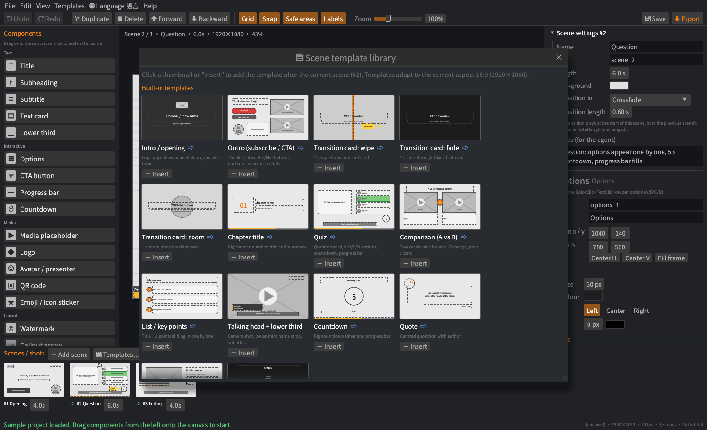
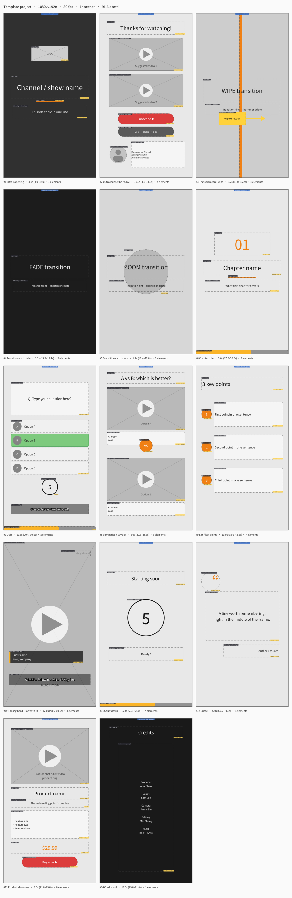
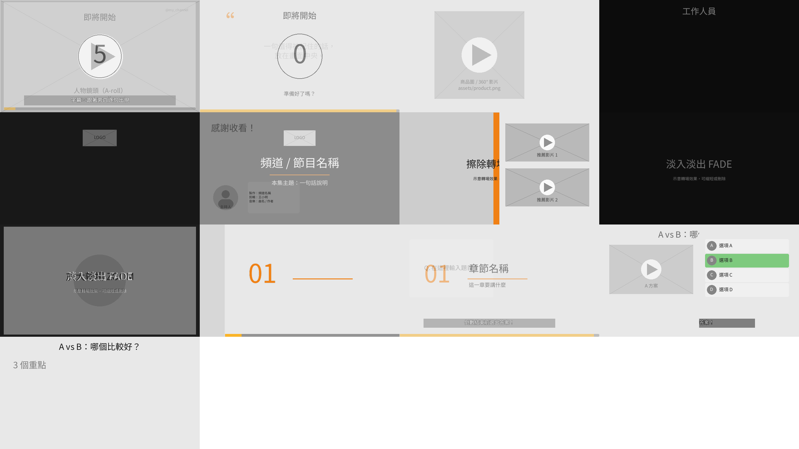
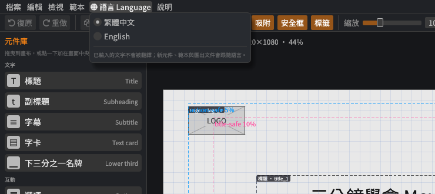
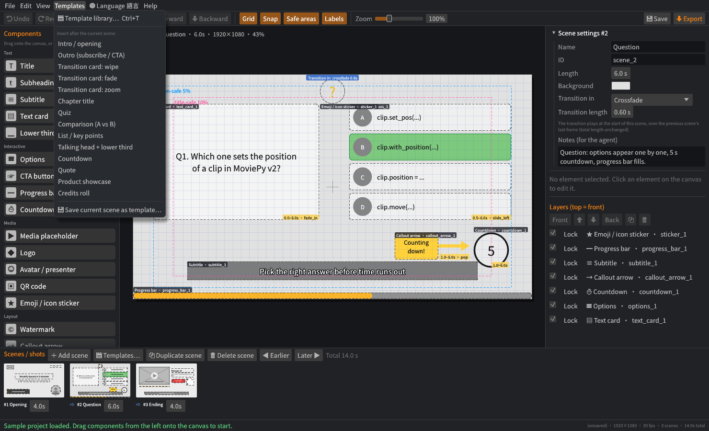

# Whitebox Video Storyboard · 白模影片版面草稿工具

[](https://github.com/stevenke1981/whitebox-video-storyboard/actions/workflows/ci.yml)
[](https://github.com/stevenke1981/whitebox-video-storyboard/releases)
[](LICENSE)

[繁體中文](README.md) · **English**

A desktop app written in **Rust + egui/eframe** for laying out *white-model* (grey-box) video frames.
Drag **subtitles, titles, subheadings, text cards, multiple-choice options (A/B/C/D)** and more onto a canvas,
arrange them into timed scenes, and export with one click:

1. **A draft PNG per scene** (rendered offscreen, no screenshots) plus an overview sheet of all scenes
2. **`layout.json`** — layout data with a documented schema (canvas, fps, scenes, every element property, scene transitions)
3. **`AGENT_GUIDE.md`** — generated instructions telling an AI agent how to map each element to **Python MoviePy v2**
   (`TextClip`, `ColorClip`, `ImageClip`, `CompositeVideoClip`, `with_position` / `with_start` / `with_duration` …)
4. **`render_moviepy.py`** — reads layout.json and renders a placeholder video (`moviepy>=2`) that the agent can build on
5. **`storyboard.html`** — a single-file storyboard page (embedded drafts, element tables, timeline, notes, MoviePy hints)
6. **`storyboard.md`** — a pure-text description of every element's position, size, text, timing and animation,
   so **an agent can understand the layout without looking at images**

Formats are selectable, and every export goes into a new **`<project name>_<date_time>`** folder so earlier exports are never overwritten.

New in 0.3.0: **14 scene templates** (intro, outro, transition cards, chapter, quiz, comparison, list, talking head,
countdown, quote, product, credits …), **scene transitions** (crossfade, fade through black, slide, wipe, zoom — implemented
in the MoviePy script), and a **繁體中文 / English UI switch** with English exported documents.



## Exported drafts

| Scene 1 opening | Scene 2 question | Scene 3 ending |
|---|---|---|
|  |  |  |

(The sample above is the Chinese sample project; `--sample x.json --lang en` creates the English one.)

Overview sheet (`storyboard_overview.png`):


Frames rendered by `render_moviepy.py` from layout.json (MoviePy 2.2, CJK text works):

| Scene 1 | Scene 2 |
|---|---|
|  |  |

## Scene templates (0.3.0)

**Templates ▸ Template library…** (Ctrl+T, or "🎬 Templates…" in the scene strip) opens the library. Click a thumbnail or
"＋ Insert" to insert the template after the current scene. Templates adapt to the canvas aspect ratio (landscape layouts for
16:9 / 4:3 / 1:1, stacked layouts for 9:16 / 4:5) and come with animations, a transition and notes for the agent.
The **Templates** menu also lists every template for one-click insertion.



| key | Template | Contents |
|---|---|---|
| `intro` | Intro / opening | logo pop, show name fade-in, episode topic (fades in from black) |
| `outro` | Outro (subscribe / CTA) | thanks, subscribe / like buttons, end-screen videos, credits |
| `transition_wipe` / `transition_fade` / `transition_zoom` | Transition cards | 1 s wipe / fade-through-black / zoom hint cards |
| `chapter` | Chapter title | big chapter number, title and summary |
| `quiz` | Quiz | question card, A/B/C/D options, countdown, progress bar |
| `comparison` | Comparison (A vs B) | two media side by side (stacked when tall), VS badge, pros / cons |
| `key_points` | List / key points | title + 3 points sliding in one by one |
| `talking_head` | Talking head + lower third | camera shot, lower-third name strap, subtitles |
| `countdown` | Countdown | big countdown timer and progress bar |
| `quote` | Quote | centred quotation with author |
| `product` | Product showcase | product shot, features, price and buy button |
| `credits` | Credits roll | staff credits scrolling up (`scroll_up`) |

**My templates**: "💾 Save current scene as template" (bottom of the library) stores the current scene — all elements,
transition and notes — as `<config dir>/whitebox-video-storyboard/templates/<name>.json`. Saved templates can be inserted into
any project (rescaled automatically when the aspect ratio differs) or deleted.

All 14 templates in English, 9:16 (`examples/templates_9x16_en.json`):



## Scene transitions (0.3.0)

"Scene settings" (right panel) has **Transition in** and **Transition length**:

| `type` | Effect |
|---|---|
| `none` | hard cut |
| `crossfade` | the new scene fades in over the last frame of the previous scene |
| `fade_black` | the new scene fades in from black (also works on the first scene) |
| `slide_left` / `slide_up` | the new scene slides in from the right / bottom |
| `wipe` | a left → right wipe reveals the new scene |
| `zoom` | the new scene grows from 70 % to 100 % while fading in |

A transition plays during the **first `duration` seconds of its scene**, on top of a freeze frame of the previous scene's last
frame, so scene start times and the total length do not change. Transitions are exported to `layout.json`
(`scene.transition = {type, duration, moviepy}` plus a top-level `transition_policy`), `AGENT_GUIDE.md` (section 6),
`storyboard.html` and `storyboard.md`; draft PNGs show a blue "Transition in" badge. `render_moviepy.py` implements every type.

Mid-transition frames rendered by MoviePy (`render_moviepy.py --frames-dir f --transition-frames`):



## Language

The **🌐 Language 語言** menu switches between **繁體中文 / English**; the choice is remembered in `settings.json`.
The UI, default texts of new elements and templates, and the exported `AGENT_GUIDE.md`, `storyboard.md`, `storyboard.html`
and draft-image labels follow the language (texts you have already typed are not translated).
On the command line use `--lang en|zh-TW` (or the `WVS_LANG` environment variable); the GUI also accepts `--lang` as a
temporary override.



## Features

- **Three-pane UI**: component palette (left), canvas (centre), properties + layers (right); scene strip with thumbnails and durations at the bottom
- **Aspect ratios**: 16:9 (1920×1080), 9:16 (1080×1920), 1:1 (1080×1080), 4:5 (1080×1350), 4:3, or custom; elements are rescaled when the ratio changes
- **Dragging**: drag from the palette to add (or click to add in the centre), drag to move, 8 resize handles (Shift keeps the aspect ratio)
- **Snapping**: grid (adjustable), frame centre lines, **title-safe (10 %) / action-safe (5 %)** areas, edges and centres of other elements; hold Alt to disable; guides are shown while snapping
- **Layers**: forward / backward / front / back, show / hide, lock; duplicate, delete; **undo / redo** (Ctrl+Z / Ctrl+Y)
- **Multiple scenes**: add / duplicate / delete / reorder; each scene has a duration, background colour, **transition** and notes for the agent
- **Scene template library**: 14 built-in templates + your own, laid out for the current aspect ratio
- **Bilingual**: Traditional Chinese / English UI and exported documents
- **18 element types** (extensible):

  | type | | type | |
  |---|---|---|---|
  | `title` | Title | `logo` | Logo |
  | `subheading` | Subheading | `avatar_frame` | Avatar / presenter |
  | `subtitle` | Subtitle | `qr_code` | QR code placeholder |
  | `text_card` | Text card | `sticker` | Emoji / icon sticker |
  | `options` | Options (A/B/C/D, correct answer can be marked) | `progress_bar` | Progress bar |
  | `lower_third` | Lower third | `countdown` | Countdown |
  | `cta_button` | CTA button | `callout_arrow` | Callout arrow |
  | `watermark` | Watermark | `shape` | Shape (rect / rounded / circle) |
  | `media_placeholder` | Image / video placeholder | `background` | Background colour |

- **Element properties**: id / name, x, y, w, h (pixels in the target resolution), text, font size, text colour, fill + opacity,
  alignment, outline, start / end time within the scene, animation hint (`none`, `fade_in`, `fade_out`, `fade_in_out`,
  `slide_up`, `slide_left`, `pop`, `typewriter`, `scroll_up`), z order, asset path `src`, notes for the agent, and type-specific
  properties (option list, correct answer, shape, arrow direction)
- **Font size = em size** (since 0.3.0): `font_size` means the same as CSS `font-size` and Pillow / MoviePy `font_size`, so
  text in the GUI, the draft PNGs and the MoviePy render has the same size. Project files from 0.2 and earlier are converted
  automatically when opened (× 0.69)
- **CJK text**: a bundled **Noto Sans CJK TC subset** (all Big5 + GB2312 characters, ~16,800 glyphs, SIL OFL 1.1) — no tofu in
  the GUI or PNG export; characters outside the subset fall back to system fonts
- **Project files**: JSON (an exported `layout.json` can be opened again)
- **Headless CLI**: exports without a display, for CI and agent automation

## Download & build

Download Windows / macOS (arm64 / x86_64) / Linux binaries from
[Releases](https://github.com/stevenke1981/whitebox-video-storyboard/releases), or build it yourself.

> 🔒 **Since 0.3.0 the release downloads are password-protected AES-256 encrypted ZIP archives.** Extract them with
> [7-Zip](https://www.7-zip.org/), Keka (macOS) or `7z x <file>.zip` (the built-in Windows Explorer / macOS Archive Utility
> unzip may not support AES). **Please ask the author for the password.** Each release also has a `SHA256SUMS.txt`.

```bash
# Linux packages (Debian/Ubuntu)
sudo apt-get install -y pkg-config libgtk-3-dev libxkbcommon-dev libgl1-mesa-dev libwayland-dev \
  libxcb-render0-dev libxcb-shape0-dev libxcb-xfixes0-dev

cargo build --release
./target/release/whitebox-video-storyboard                    # GUI (loads the sample project)
./target/release/whitebox-video-storyboard --lang en          # GUI in English
./target/release/whitebox-video-storyboard my_project.json    # open a project
```

Requires Rust 1.88 or newer.

## Usage

1. Choose the aspect ratio and fps at the top left
2. Drag components from the **palette** onto the canvas; drag to move, pull handles to resize
3. Edit text, colours, timing and animation in the **properties** panel; reorder in **layers**
4. Add shots in the **scene strip** (or insert a **template**, Ctrl+T) and set each scene's duration and transition
5. **File ▸ Export…** (Ctrl+E) opens the export dialog: tick the formats, choose the location and press "Export"



| Shortcut | Action |
|---|---|
| drag element / handle | move / resize (Shift = keep ratio, Alt = no snapping) |
| arrows, Shift+arrows | nudge 1 px / 10 px |
| Delete | delete |
| Ctrl+D | duplicate element |
| `]` / `[` | layer up / down |
| Ctrl+Z / Ctrl+Y | undo / redo |
| Ctrl+S / Ctrl+Shift+S / Ctrl+O | save / save as / open |
| Ctrl+E | export |
| Ctrl+T | scene template library |
| Ctrl+wheel | zoom the canvas |

### Export folder

Each export creates **a new folder** inside the chosen location:

```
<location>/<project file name or untitled>_<YYYYMMDD_HHMMSS>/     e.g. ~/Documents/quiz_20261004_235314/
```

- The name comes from the open project file (`quiz.json` → `quiz`), or `untitled`; invalid characters become `_`
- Local time; repeated exports within the same second get `_2`, `_3` …
- The location defaults to the last used one → the project's folder → your Documents folder
- The full path is shown afterwards, with "Open folder" and "Copy path"
- Untick "Create a project_date_time sub-folder" to write directly into the location
- Chosen formats, draft options, location and the UI language are remembered in
  `~/.config/whitebox-video-storyboard/settings.json` (Windows: `%APPDATA%\whitebox-video-storyboard\`,
  macOS: `~/Library/Application Support/whitebox-video-storyboard/`); user templates live in the `templates/` folder next to it

### Export formats

| Option | CLI name | Output | Description |
|---|---|---|---|
| Scene PNGs | `png` | `scene_01_<id>.png` … | white-model draft per scene (target resolution, optional type/timing labels and safe areas) |
| Overview sheet | `overview` | `storyboard_overview.png` | thumbnails of all scenes |
| layout.json | `layout` | `layout.json` | layout data (schema: [docs/LAYOUT_SCHEMA.md](docs/LAYOUT_SCHEMA.md)) |
| Project file | `project` | `project.json` | re-editable project |
| Agent guide | `guide` | `AGENT_GUIDE.md` | MoviePy instructions for an AI agent (per-scene element tables, transitions) |
| MoviePy script | `script` | `render_moviepy.py` | renders a placeholder video from layout.json (moviepy>=2) |
| HTML storyboard | `html` | `storyboard.html` | **single file**: base64-embedded drafts, hover highlighting, timeline, per-scene Gantt chart, element table, transitions, notes, MoviePy snippets |
| Markdown description | `md` | `storyboard.md` | **pure text**: coordinate system, safe areas, timeline; per scene an ASCII sketch and every element's position (3×3 region + pixels + percent), size, text, style, timing, animation, overlaps and MoviePy hints, plus the event order |
| CJK font | `font` | `fonts/NotoSansCJKtc-Subset.otf` | font for TextClip (+ OFL licence) |

Full example: [`examples/sample_export/`](examples/sample_export/).

## Command line / headless

```bash
# creates sample_project_YYYYMMDD_HHMMSS/ in the current folder with every format
whitebox-video-storyboard --export examples/sample_project.json

# location and formats (first stdout line = created folder, then one line per file)
whitebox-video-storyboard --export project.json ~/exports --formats png,html,md
whitebox-video-storyboard --export project.json out --formats md --name quiz   # → out/quiz_YYYYMMDD_HHMMSS/storyboard.md
whitebox-video-storyboard --export project.json out_dir --no-subdir            # write directly (CI / scripts)

whitebox-video-storyboard --render project.json 2 scene2.png     # only scene 2
whitebox-video-storyboard --sample my.json --preset 9:16 --lang en

# scene templates
whitebox-video-storyboard --templates --lang en                               # list templates
whitebox-video-storyboard --from-templates intro,quiz,outro new.json --preset 9:16 --name "My short" --lang en
whitebox-video-storyboard --from-templates all demo.json --lang en            # all 14
whitebox-video-storyboard --add-template project.json chapter,quiz --at 2 -o out.json   # insert after scene 2

# English documents (AGENT_GUIDE / Markdown / HTML) and messages
whitebox-video-storyboard --export demo.json out --lang en
whitebox-video-storyboard --help --lang en
```

| Option | Description |
|---|---|
| `[out_base]` | output location, default = current folder |
| `--formats <list>` | comma-separated `png,overview,layout,project,guide,script,html,md,font`, or `all` (default). Aliases: `json`→layout, `agent`→guide, `moviepy`/`py`→script, `markdown`→md, `fonts`→font |
| `--no-subdir` | do not create the `<name>_<time>` sub-folder |
| `--name <name>` | sub-folder name prefix (default: project file name) |
| `--no-font` / `--no-overview` | drop the font / overview from the formats |
| `--no-annotations` / `--safe-guides` | PNGs without type/timing labels / with safe-area guides |
| `--lang en\|zh-TW` | language for any command (default: `WVS_LANG`, else Traditional Chinese) |

Getting the export folder in a script: `DIR=$(whitebox-video-storyboard --export p.json out | head -n1)`

## Rendering with MoviePy

```bash
python -m venv .venv && . .venv/bin/activate
pip install -r examples/requirements.txt           # moviepy>=2, numpy, pillow
cd ~/exports/quiz_20261004_235314                  # an export folder
python render_moviepy.py layout.json -o draft.mp4 --preview      # 1/3 resolution, 12 fps preview
python render_moviepy.py layout.json -o final.mp4                 # full size
python render_moviepy.py layout.json --frames-dir frames --no-video                 # one frame per scene
python render_moviepy.py layout.json --frames-dir f --transition-frames --no-video  # plus the middle of every transition
python render_moviepy.py layout.json -o cut.mp4 --no-transitions                    # hard cuts
```

- Position: `clip.with_position((x, y))` (top-left); timing: `with_start(start)` / `with_duration(end - start)` (scene-relative);
  scenes are `CompositeVideoClip`s joined with `concatenate_videoclips`. A transition puts an `ImageClip` of the previous scene's
  last frame underneath and the new scene on top with `CrossFadeIn` / a position function / a mask / `resized` (total length unchanged)
- Placeholders with `src` (image / video / logo / avatar / QR / sticker) are replaced by the real asset (cover-fit; circular mask for avatars)
- **CJK fonts**: `TextClip(font=...)` needs a font file with CJK glyphs. The script looks at `--font`, `$WVS_FONT`,
  `fonts.cjk` in layout.json, `fonts/` next to the script, the repo's `assets/fonts/`, then system fonts
- The script wraps text itself (mixed CJK/Latin, kinsoku), shrinks text that does not fit its box, and works around
  MoviePy 2.x clipping descenders of fonts with a large ascent (Noto CJK)

## Suggested AI-agent workflow

1. A human lays out the white model with this tool → export (with `--lang en` if the agent prefers English)
2. The agent reads `AGENT_GUIDE.md`, `storyboard.md` (layout as text) and `layout.json` (exact numbers); PNGs / `storyboard.html` for visual checks
3. Run `render_moviepy.py --preview` for a playable placeholder, then replace assets according to `notes` / `src`, add voice-over and music
4. Compare `--frames-dir` frames with `scene_*.png` to verify the layout

## Binary size

| Version | Size (Linux x86_64, GUI + CLI) |
|---|---|
| 0.1.0 | 18.7 MB |
| 0.2.0 | 12.0 MB (opt-level "s", fat LTO, Brotli-compressed font, no egui default fonts) |
| 0.3.0 (+ templates, transitions, i18n) | 12.2 MB |

## Adding a new element type

1. `src/model.rs`: add an `ElementKind` variant, extend `ALL`, `info()` (names, icon, group, MoviePy hint), `key()` and the defaults in `Element::new`
2. `src/draw.rs`: draw its white-model look in `element_prims` (shared by the GUI and PNG export)
3. `src/guide.rs`: add a MoviePy snippet in `snippet()`
4. `examples/render_moviepy.py`: add a branch in `build_element()` (unknown types are drawn as labelled boxes)

## Known limitations

- Emoji stickers are monochrome in PNG / GUI (no colour emoji in the bundled font); use `src` with an image for the video
- The font subset covers Big5 + GB2312; rarer characters use system fonts or show a box
- Line breaks may differ by a character or two between the preview and MoviePy (different font engines)
- Animations and transitions are only implemented in the MoviePy script; the editor shows yellow / blue labels (no timeline playback)
- Switching the language does not translate texts you typed; template texts are generated in the current language when inserted

## License

- Code: [MIT](LICENSE) © 2026 Ke Sheng Da
- Bundled font `assets/fonts/NotoSansCJKtc-Subset.otf`: Noto Sans CJK TC subset, [SIL Open Font License 1.1](assets/fonts/LICENSE-OFL.txt)
