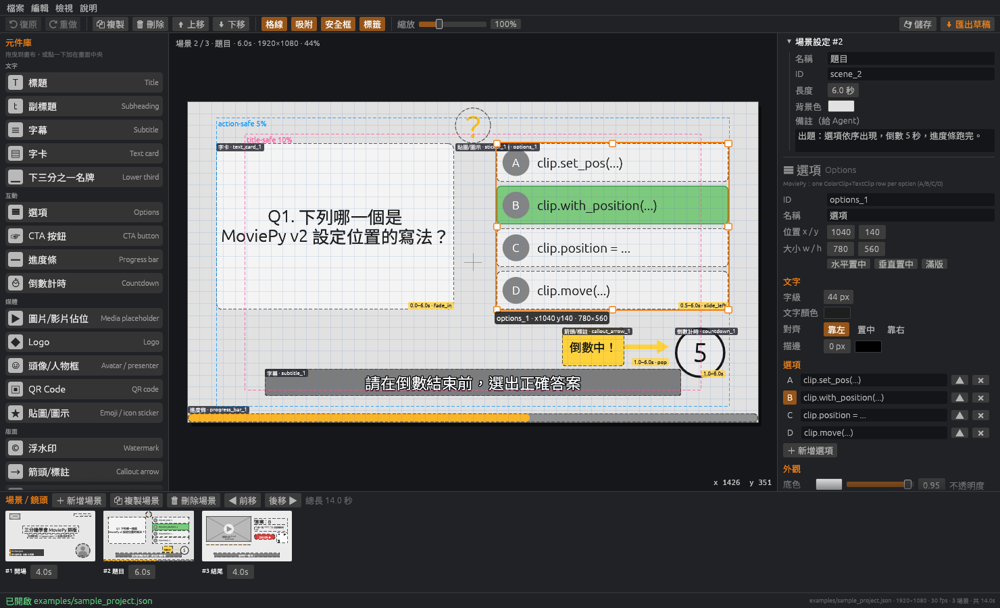
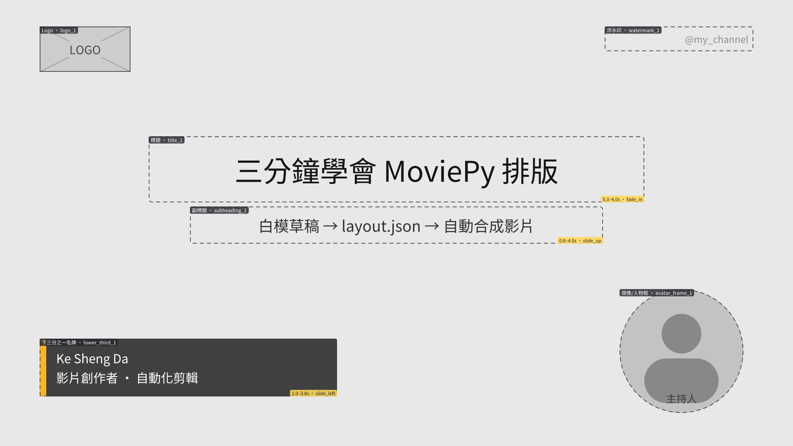
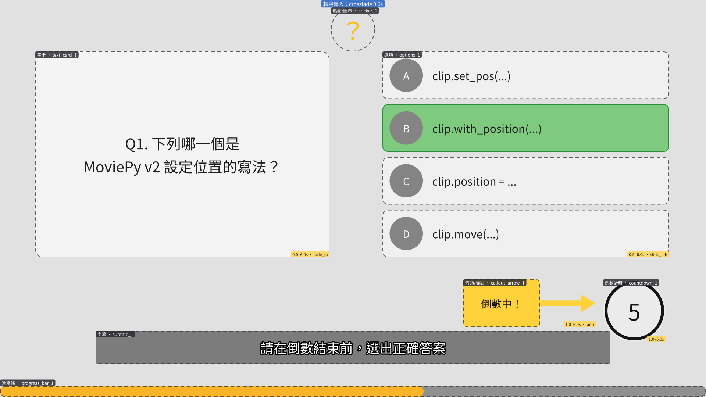
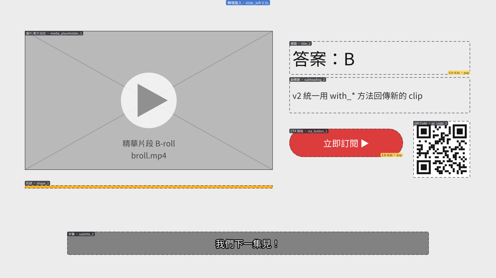
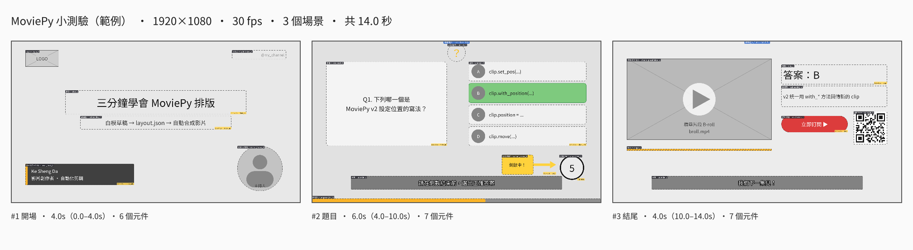
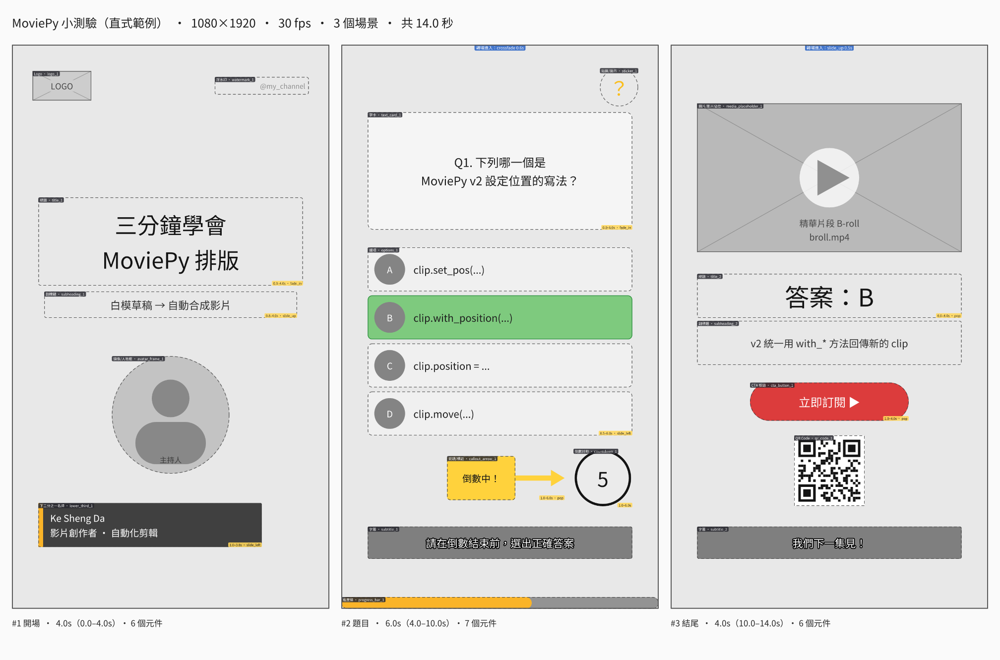
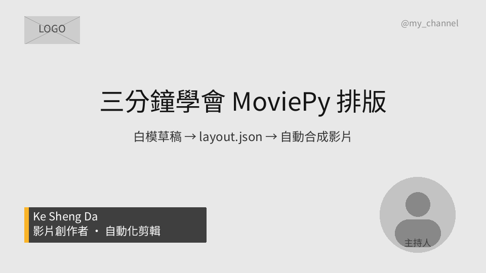
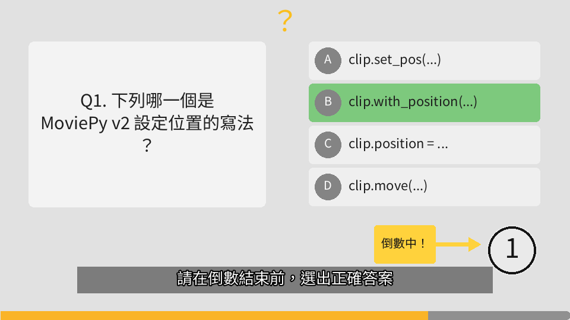
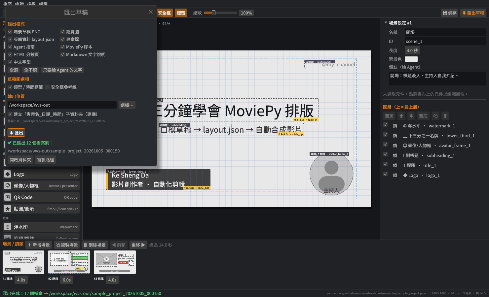

# 白模影片版面草稿工具 · Whitebox Video Storyboard

[](https://github.com/stevenke1981/whitebox-video-storyboard/actions/workflows/ci.yml)
[](https://github.com/stevenke1981/whitebox-video-storyboard/releases)
[](LICENSE)

用 **Rust + egui/eframe** 寫的桌面工具：把 **字幕、標題、副標題、字卡、選項（A/B/C/D）**……等元件
拖曳到畫布上，排出像「白模」一樣的影片畫面草稿，然後一鍵匯出：

1. **每個場景的草稿 PNG**（離線渲染，不靠截圖）＋ 全部場景總覽圖
2. **`layout.json`**——有文件化 schema 的版面資料（畫布、fps、場景、每個元件的所有屬性）
3. **`AGENT_GUIDE.md`**——自動產生，告訴 AI Agent 如何把每種元件對應到 **Python MoviePy v2**
   （`TextClip`、`ColorClip`、`ImageClip`、`CompositeVideoClip`、`with_position` / `with_start` / `with_duration`…）
4. **`render_moviepy.py`**——讀取 layout.json 直接合成佔位影片（`moviepy>=2`），Agent 可以在它上面替換素材
5. **`storyboard.html`**——單一檔案的分鏡網頁（內嵌草稿圖、元件表、時間軸、備註、MoviePy 提示），用瀏覽器直接打開
6. **`storyboard.md`**——純文字（繁體中文）版面說明：每個元件的位置、大小、文字、時間、動畫，**Agent 不看圖也能理解版面**

匯出格式可以自由勾選，每次匯出會自動建立 **`<專案檔名>_<日期_時間>`** 資料夾，不會覆蓋上一次的結果。



## 匯出的草稿圖

| 場景 1 開場 | 場景 2 題目 | 場景 3 結尾 |
|---|---|---|
|  |  |  |

總覽圖（`storyboard_overview.png`）：



9:16 直式（Shorts / Reels）範例：



由 `render_moviepy.py` 依 layout.json 合成出來的影片影格（MoviePy 2.2，中文字型正常）：

| 場景 1 | 場景 2 |
|---|---|
|  |  |

## 功能

- **三欄式介面**：左側元件庫、中間畫布、右側屬性面板＋圖層；下方場景（鏡頭）列表含縮圖與秒數
- **畫布比例**：16:9（1920×1080）、9:16（1080×1920）、1:1（1080×1080）、4:5（1080×1350）、4:3，或自訂寬高；切換比例時元件會自動等比縮放
- **拖曳**：從元件庫拖到畫布新增（或點一下加在中央）、拖曳移動、8 個控制點調整大小（Shift 等比例）
- **吸附**：格線（可調間距）、畫面中線、**Title-safe（10%）/ Action-safe（5%）** 安全框、其他元件的邊與中心；Alt 暫停吸附，吸附時顯示參考線
- **圖層**：上移／下移／置頂／置底、顯示／隱藏、鎖定；複製、刪除；**復原／重做**（Ctrl+Z / Ctrl+Y）
- **多場景**：新增／複製／刪除／排序場景，每個場景有長度（秒）、背景色、給 Agent 的備註
- **18 種元件**（可擴充）：

  | 類型 | 中文 | | 類型 | 中文 |
  |---|---|---|---|---|
  | `title` | 標題 | | `logo` | Logo |
  | `subheading` | 副標題 | | `avatar_frame` | 頭像 / 人物框 |
  | `subtitle` | 字幕 | | `qr_code` | QR Code 佔位 |
  | `text_card` | 字卡 | | `sticker` | Emoji / 圖示貼圖 |
  | `options` | 選項（A/B/C/D，可標記正確答案） | | `progress_bar` | 進度條 |
  | `lower_third` | 下三分之一名牌 | | `countdown` | 倒數計時 |
  | `cta_button` | CTA 按鈕 | | `callout_arrow` | 箭頭 / 標註 |
  | `watermark` | 浮水印 | | `shape` | 形狀（矩形 / 圓角 / 圓形） |
  | `media_placeholder` | 圖片 / 影片佔位 | | `background` | 背景色 |

- **每個元件的屬性**：id / 名稱、x, y, w, h（目標解析度像素）、文字、字級、文字顏色、底色＋不透明度、對齊、描邊、
  場景內開始 / 結束時間、動畫提示（`none`、`fade_in`、`fade_out`、`fade_in_out`、`slide_up`、`slide_left`、`pop`、`typewriter`）、
  z 順序、素材路徑 `src`、給 Agent 的備註，以及各類型專屬屬性（選項列表、正確答案、形狀、箭頭方向）
- **中文顯示**：內附 **Noto Sans CJK TC 子集**（Big5 + GB2312 全部字元，約 16,800 字，SIL OFL 1.1），GUI 與 PNG 匯出都不會出現豆腐字；子集外的字會再嘗試系統字型（微軟正黑體、PingFang、Noto CJK…）
- **專案存檔**：JSON（`layout.json` 也可以直接開回來編輯）
- **無頭模式（CLI）**：不需要顯示器即可匯出，方便 CI 或 Agent 自動化

## 下載與建置

到 [Releases](https://github.com/stevenke1981/whitebox-video-storyboard/releases) 下載 Windows / macOS / Linux 執行檔，或自行建置：

```bash
# Linux 需要的套件（Debian/Ubuntu）
sudo apt-get install -y pkg-config libgtk-3-dev libxkbcommon-dev libgl1-mesa-dev libwayland-dev \
  libxcb-render0-dev libxcb-shape0-dev libxcb-xfixes0-dev

cargo build --release
./target/release/whitebox-video-storyboard                 # 開 GUI（預設載入範例專案）
./target/release/whitebox-video-storyboard my_project.json # 開啟專案
```

需要 Rust 1.88 以上。

## 使用方式

1. 左上選擇畫布比例與 fps
2. 從左側 **元件庫** 拖曳元件到畫布，拖曳移動、拉控制點調整大小
3. 右側 **屬性面板** 修改文字、顏色、時間、動畫；**圖層** 調整上下順序
4. 下方 **場景列表** 新增鏡頭、設定每個場景的秒數
5. **檔案 ▸ 匯出…**（Ctrl+E）開啟匯出視窗：勾選格式、選擇輸出位置，按「匯出」



| 快捷鍵 | 功能 |
|---|---|
| 拖曳元件 / 控制點 | 移動 / 調整大小（Shift 等比例、Alt 暫停吸附） |
| 方向鍵、Shift+方向鍵 | 微調 1px / 10px |
| Delete | 刪除 |
| Ctrl+D | 複製元件 |
| `]` / `[` | 上移 / 下移圖層 |
| Ctrl+Z / Ctrl+Y | 復原 / 重做 |
| Ctrl+S / Ctrl+Shift+S / Ctrl+O | 儲存 / 另存 / 開啟 |
| Ctrl+E | 匯出 |
| Ctrl+滾輪 | 縮放畫布 |

### 匯出資料夾

每次匯出都會在「輸出位置」裡**新建一個資料夾**，所有檔案都放在裡面：

```
<輸出位置>/<專案檔名或 untitled>_<YYYYMMDD_HHMMSS>/     例：~/Documents/quiz_20261004_235314/
```

- 專案檔名取自目前開啟的專案（`quiz.json` → `quiz`），尚未存檔時為 `untitled`；檔名中不合法的字元會換成 `_`
- 時間是本機時間；同一秒內重複匯出會自動加上 `_2`、`_3`…
- 輸出位置預設為「上次使用的位置」→ 專案檔所在資料夾 → 使用者的「文件」資料夾；可在匯出視窗中修改或按「選擇…」
- 匯出完成後，視窗與狀態列會顯示建立的完整路徑，並可「開啟資料夾」或「複製路徑」
- 取消勾選「建立『專案名_日期_時間』子資料夾」則直接寫入輸出位置（舊版行為）
- 勾選的格式、草稿圖選項、輸出位置會記住，存在 `~/.config/whitebox-video-storyboard/settings.json`
  （Windows：`%APPDATA%\whitebox-video-storyboard\`，macOS：`~/Library/Application Support/whitebox-video-storyboard/`）

### 匯出格式

| 勾選項目 | CLI 名稱 | 輸出檔案 | 說明 |
|---|---|---|---|
| 場景草稿 PNG | `png` | `scene_01_<id>.png`… | 每個場景的白模草稿（目標解析度，可含類型/時間標籤、安全框） |
| 總覽圖 | `overview` | `storyboard_overview.png` | 所有場景縮圖總覽 |
| 版面資料 layout.json | `layout` | `layout.json` | 版面資料（schema 見 [docs/LAYOUT_SCHEMA.md](docs/LAYOUT_SCHEMA.md)） |
| 專案檔 | `project` | `project.json` | 可再用本工具開啟編輯的專案檔 |
| Agent 指南 | `guide` | `AGENT_GUIDE.md` | 給 AI Agent 的 MoviePy 配置說明（逐場景元件表；只列出有勾選的檔案） |
| MoviePy 腳本 | `script` | `render_moviepy.py` | 讀 layout.json 合成佔位影片（moviepy>=2） |
| HTML 分鏡頁 | `html` | `storyboard.html` | **單一檔案**：草稿圖以 base64 內嵌，滑鼠移到元件會標示對應框與表格列；含時間軸、每場景甘特圖、元件表（位置、大小、時間、動畫、樣式）、導演/Agent 備註與 MoviePy 程式片段 |
| Markdown 文字說明 | `md` | `storyboard.md` | **純文字**繁中說明：座標系與安全框、時間軸；每個場景有 ASCII 版面速寫，逐一描述元件的位置（九宮格區域＋像素＋百分比）、大小、文字內容、樣式、時間（場景內／絕對）、動畫、重疊關係與 MoviePy 提示，最後列出事件順序 |
| 中文字型 | `font` | `fonts/NotoSansCJKtc-Subset.otf` | 給 TextClip 用的中文字型（＋ OFL 授權） |

```
quiz_20261004_235314/
├── scene_01_scene_1.png      ├── storyboard.html
├── scene_02_scene_2.png      ├── storyboard.md
├── storyboard_overview.png   ├── AGENT_GUIDE.md
├── layout.json               ├── render_moviepy.py
├── project.json              └── fonts/NotoSansCJKtc-Subset.otf (+ LICENSE-OFL.txt)
```

完整範例：[`examples/sample_export/`](examples/sample_export/)（其中
[`storyboard.md`](examples/sample_export/storyboard.md)、`storyboard.html` 可直接查看）。

## 命令列 / 無頭模式

```bash
# 在目前資料夾建立 sample_project_YYYYMMDD_HHMMSS/ 並輸出全部格式
whitebox-video-storyboard --export examples/sample_project.json

# 指定輸出位置與格式（stdout 第一行是建立的資料夾路徑，其後是每個檔案）
whitebox-video-storyboard --export project.json ~/exports --formats png,html,md
whitebox-video-storyboard --export project.json out --formats md --name quiz   # → out/quiz_YYYYMMDD_HHMMSS/storyboard.md

# 直接寫入指定資料夾（不建立時間戳記子資料夾，適合 CI / 腳本）
whitebox-video-storyboard --export project.json out_dir --no-subdir

whitebox-video-storyboard --render project.json 2 scene2.png     # 只輸出第 2 個場景
whitebox-video-storyboard --sample my.json --preset 9:16          # 產生範例專案
whitebox-video-storyboard --help
```

| 參數 | 說明 |
|---|---|
| `[out_base]` | 輸出位置，預設為目前資料夾 |
| `--formats <list>` | 逗號分隔：`png,overview,layout,project,guide,script,html,md,font`，或 `all`（預設）。也接受別名 `json`→layout、`agent`→guide、`moviepy`/`py`→script、`markdown`→md、`fonts`→font |
| `--no-subdir` | 不建立 `<名稱>_<時間>` 子資料夾，直接寫入 `out_base` |
| `--name <name>` | 子資料夾名稱前綴（預設為專案檔名） |
| `--no-font` / `--no-overview` | 從格式中移除字型 / 總覽圖（相容 0.1 版） |
| `--no-annotations` / `--safe-guides` | PNG 不畫類型/時間標籤 / 畫出安全框 |

腳本中取得輸出資料夾：`DIR=$(whitebox-video-storyboard --export p.json out | head -n1)`

## 用 MoviePy 合成影片

```bash
python -m venv .venv && . .venv/bin/activate
pip install -r examples/requirements.txt           # moviepy>=2, numpy, pillow
cd ~/exports/quiz_20261004_235314          # 匯出資料夾
python render_moviepy.py layout.json -o draft.mp4 --preview      # 1/3 解析度、12fps 快速預覽
python render_moviepy.py layout.json -o final.mp4                 # 原尺寸
python render_moviepy.py layout.json --frames-dir frames --no-video   # 只輸出每個場景的影格
```

- 元件位置：`clip.with_position((x, y))`（左上角）、時間：`with_start(start)` / `with_duration(end - start)`（相對於場景）、
  場景以 `CompositeVideoClip` 疊合後 `concatenate_videoclips` 串接
- 有 `src` 的佔位（圖片／影片／Logo／頭像／QR／貼圖）會自動換成真實素材（cover-fit 裁切，頭像可圓形遮罩）
- **中文字型**：`TextClip(font=...)` 一定要給含中文的字型檔。腳本依序找 `--font`、環境變數 `WVS_FONT`、
  layout.json 的 `fonts.cjk`、腳本旁的 `fonts/`、repo 的 `assets/fonts/`，最後是系統字型（Noto CJK、微軟正黑體、PingFang…）。
  `.ttc` 字型集合在 Pillow 中固定使用第 0 個字面。
- 腳本會先自行斷行（中英混排、避頭點）、超出框高時自動縮小字級，並修正 MoviePy 2.x 在大 ascent 字型（Noto CJK）上
  會裁掉字尾的問題。

`render_moviepy.py` 會依序在匯出資料夾內的 `fonts/` 找字型，所以整個匯出資料夾可以直接搬到別處執行。

範例：`examples/layout.json`（範例 layout）、`examples/render_moviepy.py`（靜態腳本副本）、`examples/sample_export/`（完整匯出結果）。

## 給 AI Agent 的建議流程

1. 人類用本工具排好白模 → 匯出
2. Agent 讀 `AGENT_GUIDE.md`、`storyboard.md`（純文字理解版面）與 `layout.json`（精確數值），PNG / `storyboard.html` 作為視覺確認
3. 先跑 `render_moviepy.py --preview` 得到可播放的佔位版，再依 `notes` / `src` 替換素材、加配音與音樂
4. 用 `--frames-dir` 輸出影格，與 `scene_*.png` 比對版面是否一致

## 執行檔大小

0.2.0 起針對發行版做了體積最佳化（Linux x86_64，GUI + CLI 單一執行檔）：

| 版本 | 大小 |
|---|---|
| 0.1.0（opt-level 3、thin LTO、未壓縮字型、egui 預設字型） | 18.7 MB（18,694,856 bytes） |
| 0.2.0 | **12.0 MB（11,952,824 bytes，−36%）** |

- `Cargo.toml` 的 `[profile.release]`：`opt-level = "s"`、`lto = "fat"`、`codegen-units = 1`、`panic = "abort"`、`strip = true`。
  實測 `"s"`（12.01 MB）比 `"z"`（12.28 MB）還小、而且匯出速度快約 30%；繪圖／PNG／解壓縮相關的 crate（tiny-skia、png、fdeflate、miniz_oxide、brotli-decompressor）個別保留 `opt-level = 3`，
  因此最終執行檔又小了一點，匯出 3 個 1080p 場景約 0.4 秒。
- **內嵌字型以 Brotli 壓縮**：`assets/fonts/NotoSansCJKtc-Subset.otf`（7.5 MB）→ `.otf.br`（5.0 MB），啟動時解壓縮一次（約 0.1 秒）。
  修改字型後執行 `python tools/compress_font.py` 重新產生（需要 `pip install brotli`）。
- 關閉 eframe 的 `default_fonts`（Ubuntu / Hack / Noto Emoji 約 1.1 MB），改用內附中文字型＋egui 的小型圖示字型；
  image crate 只開 PNG；egui 只用 `glow` 後端（不含 wgpu）。

## 擴充新元件

1. `src/model.rs`：在 `ElementKind` 加一個 variant，補上 `ALL`、`info()`（中文名、圖示、群組、MoviePy 提示）、`key()`，以及 `Element::new` 的預設尺寸與文字
2. `src/draw.rs`：在 `element_prims` 畫出白模外觀（GUI 與 PNG 共用同一套繪圖指令）
3. `src/guide.rs`：在 `snippet()` 加上 MoviePy 範例
4. `examples/render_moviepy.py`：在 `build_element()` 加一個分支（未知類型會自動畫成有標籤的方框，不會壞掉）

## 已知限制

- Emoji 貼圖在 PNG / GUI 中以單色字形顯示（內附字型不含彩色 emoji）；影片中建議用 `src` 指定圖片
- 字型子集涵蓋 Big5 + GB2312；罕用字會改用系統字型，若系統也沒有則顯示方框
- GUI 預覽與 MoviePy 成品的文字斷行可能有 1～2 字差異（不同字型引擎）
- 動畫只在 MoviePy 腳本中實作，編輯器中以黃色標籤標示（不做時間軸預覽播放）

## 授權

- 程式碼：[MIT](LICENSE) © 2026 Ke Sheng Da
- 內附字型 `assets/fonts/NotoSansCJKtc-Subset.otf`：Noto Sans CJK TC 子集，[SIL Open Font License 1.1](assets/fonts/LICENSE-OFL.txt)

---

## English

**Whitebox Video Storyboard** is a Rust (egui/eframe) desktop app for laying out *white-model* (grey-box) video frames.
Drag subtitle, title, subheading, text-card, multiple-choice options and 13 more component types onto a 16:9 / 9:16 / 1:1 / 4:5 canvas,
organise them into timed scenes, then export:

- per-scene draft PNGs rendered offscreen (tiny-skia + ab_glyph, bundled Noto Sans CJK TC subset so Chinese never renders as tofu),
- `layout.json` with a documented schema ([docs/LAYOUT_SCHEMA.md](docs/LAYOUT_SCHEMA.md)),
- an auto-generated `AGENT_GUIDE.md` telling an AI agent how to map each element to MoviePy v2 (`TextClip`, `ColorClip`, `ImageClip`, `CompositeVideoClip`, `with_position` / `with_start` / `with_duration`, CrossFadeIn/Out…),
- `render_moviepy.py`, a working reference renderer for `moviepy>=2` that builds a placeholder video from the layout,
- `storyboard.html`, a self-contained storyboard page (embedded scene images, element tables, timing, notes, MoviePy hints),
- `storyboard.md`, a pure-text (Traditional Chinese) description of every scene and element (position, size, text, timing, animation) so an agent can understand the layout without images.

Each export goes into a new `<project name|untitled>_<YYYYMMDD_HHMMSS>` folder inside the chosen location; formats are selectable in the export dialog (remembered between runs) or with `--formats png,overview,layout,project,guide,script,html,md,font`.

Features: snapping to grid / title-safe / action-safe / other elements, resize handles, layer ordering, duplicate, undo/redo, multi-scene list with durations,
JSON save/load, and a headless CLI (`--export project.json [out_base] [--formats …] [--no-subdir] [--name …]`; first stdout line = created folder) for CI and agents. The release binary is size-optimised (Linux: 18.7 MB → 12.0 MB in 0.2.0). Build with `cargo build --release`; prebuilt binaries for
Linux, Windows and macOS are attached to each GitHub release.
